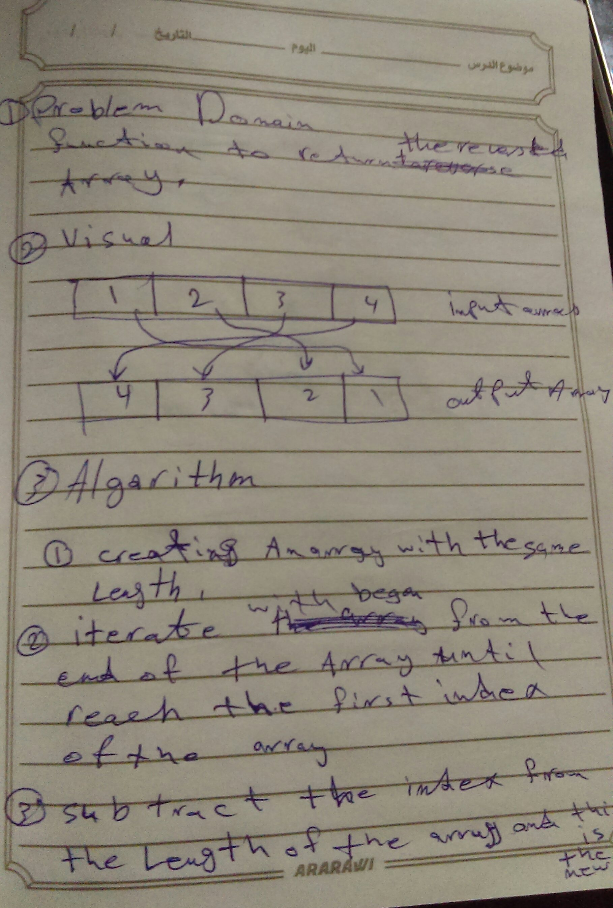
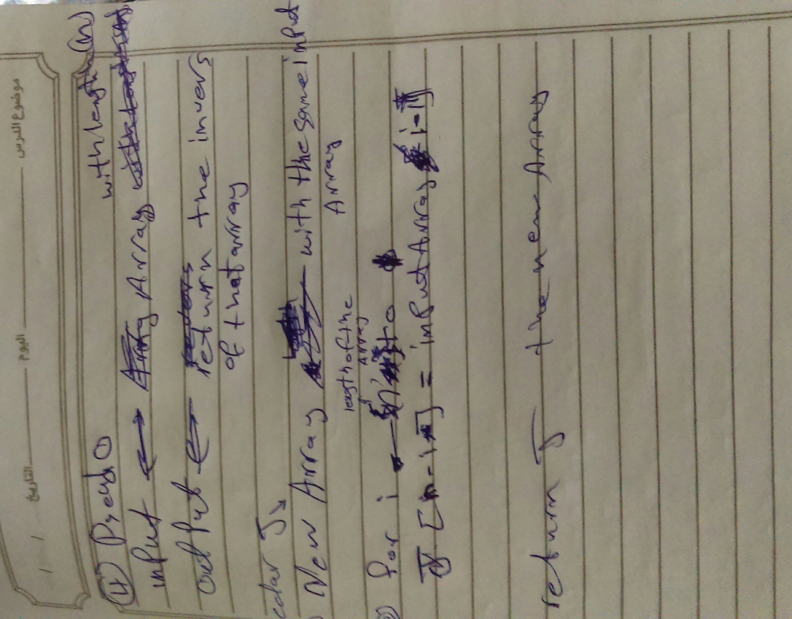

# data-structures-and-algorithms

#### Table of Contents

|  ***#Read*** |      link      |
|----------|:-------------:|
| Reverse | [Reverse Array](./challenges/arrayReverse/README.md) |
| Shift | [ArrayShift](./challenges/arrayShift/README.md) |
|  |  |
|  |  |
|  |  |
|  |  |
|  |  |
|  |  |
|  |  |
|  |  |
|  |  |
|  |  |
|  |  |
|  |  |
|  |  |

<!-- 
## Reverse an Array

### Challenge
function that reverse any ary in the world

### Approach & Efficiency

i used the for loop/easiest way/ and after searching i think the big O is O(n):linear 

### Solution

 -->

