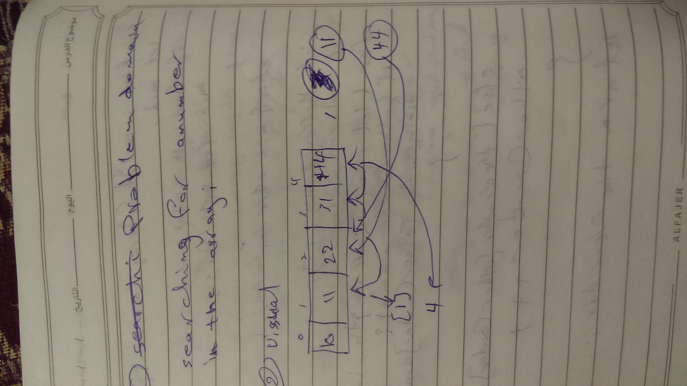
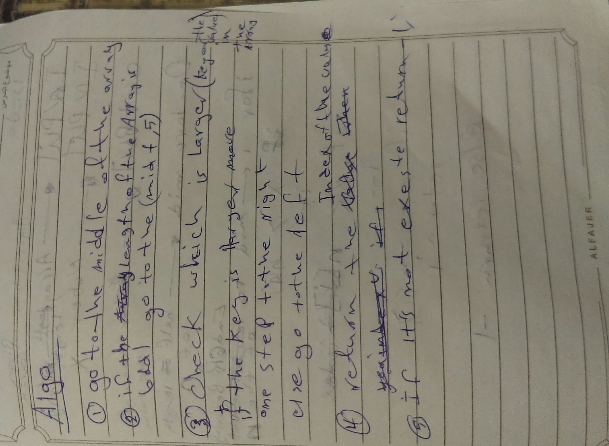
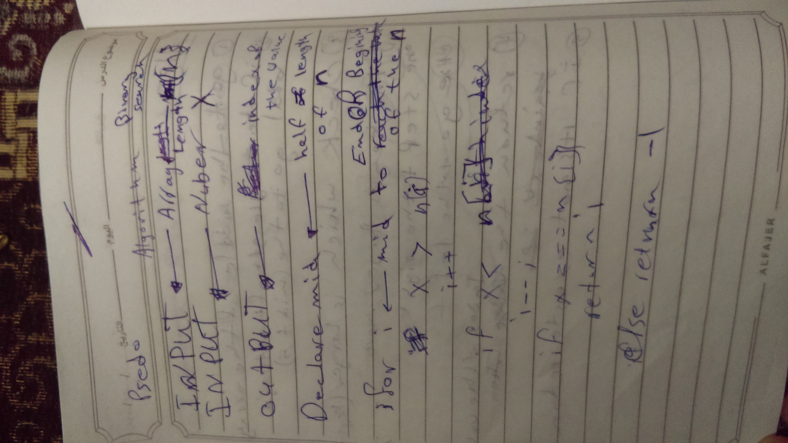

## [PR URL](https://github.com/yousef-401-advanced-javascript/data-structures-and-algorithms/pull/3)
## Array Binary Search
from the resource this is a data structure searching metode
### Challenge
writing  a function to search for a number

### Approach & Efficiency

i used the for loop and switch statement /easiest way/ i think the big O is O(n):linear but im not sure

### Solution

