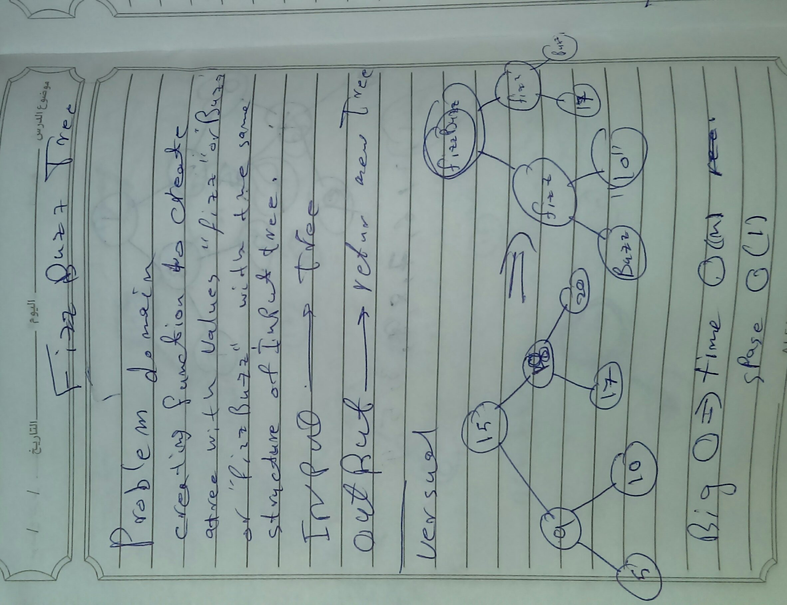

# Tree
<!-- Short summary or background information -->
## Challenge
<!-- Description of the challenge -->
- Creating function with input tree to change the values of the tree to fizz if the value of the node divided by 3 and buzz if it divided by 5 and fizzBuzz if is divided both outer wise return string of the value.
## Approach & Efficiency
<!-- What approach did you take? Why? What is the Big O space/time for this approach? -->
- the BIG O  is O(n) for time and O(1)for the space

## Solution

