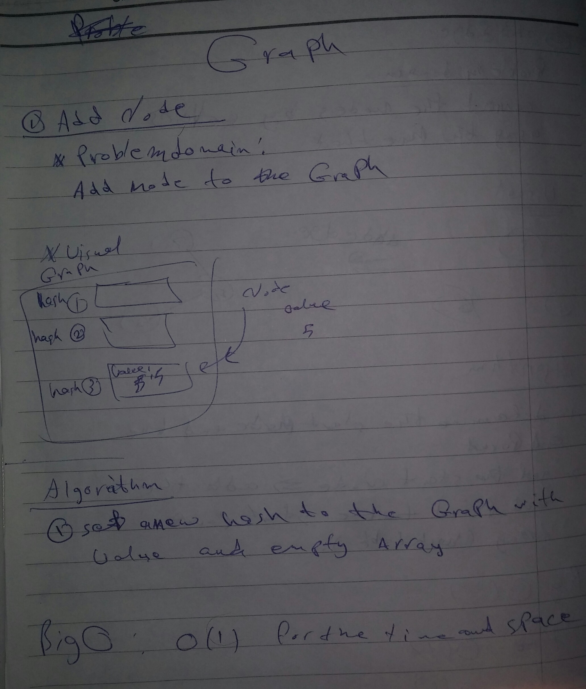
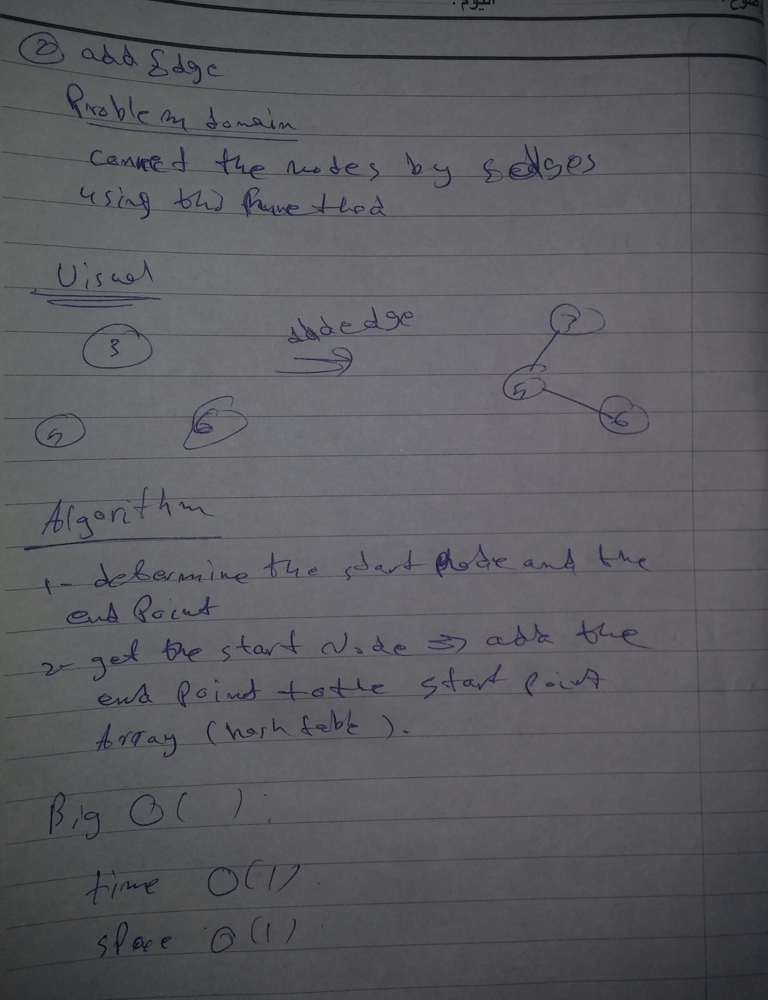
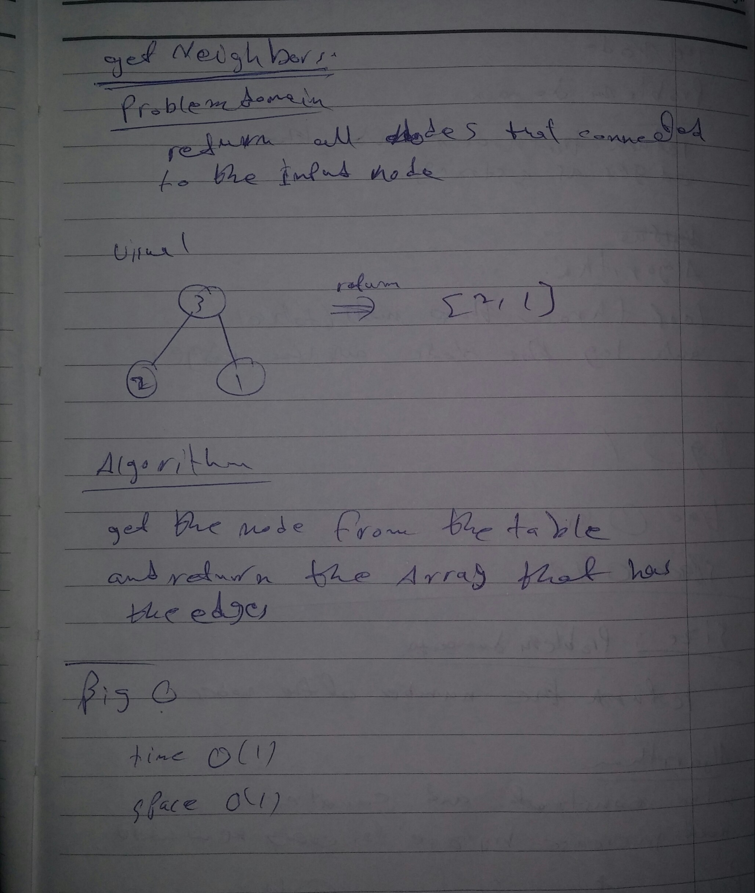
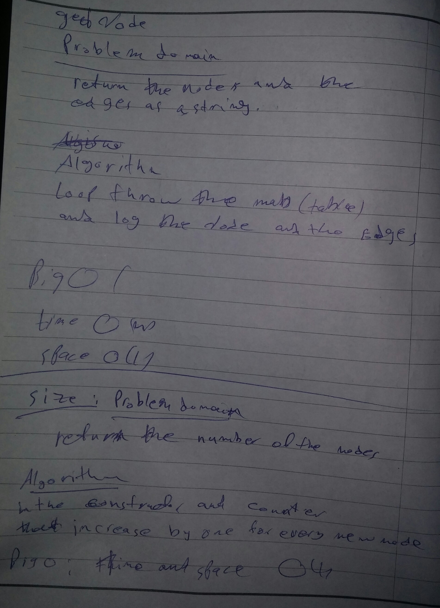

# Graph
<!-- Short summary or background information -->
a graph is an abstract data type that is meant to implement the undirected graph and directed graph concepts from the field of graph theory within mathematics.

## Approach & Efficiency
<!-- What approach did you take? Why? What is the Big O space/time for this approach? -->

Graph methods
- **(addNode)** : tha BIG O is O(1) for the time and space 
- **(addEdge)** :tha BIG O is O(1) for the time and space 
- **(getNeighbors)** :tha BIG O is O(1) for the time and space 
- **(getNodes)** :tha BIG O is O(n) for the time and O(1) for the space 
- **(size)** :tha BIG O is O(1) for the time and space 

## Solution

