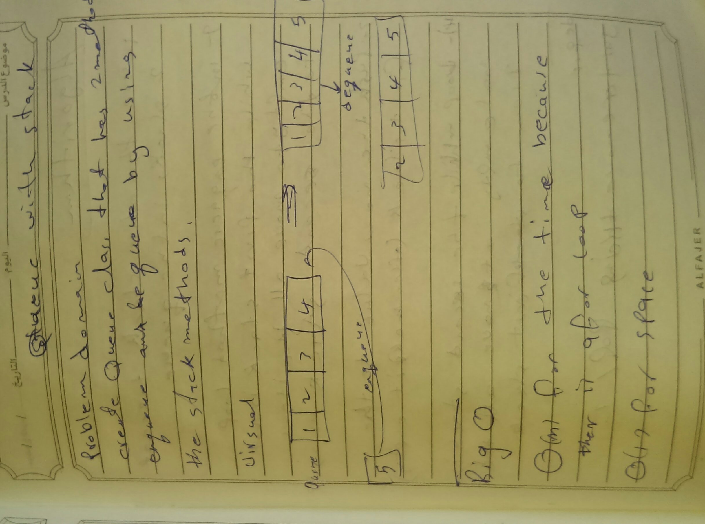
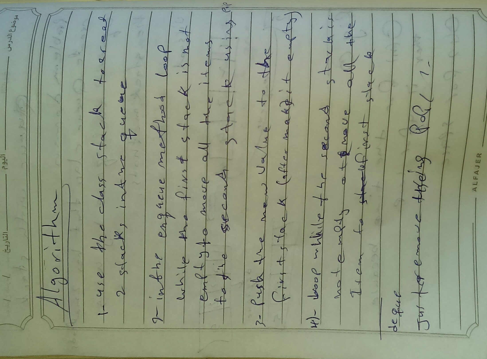

# Stacks and Queues
<!-- Short summary or background information -->
**Queue:(First In First Out):** linear structure which follows a particular order in which the operations are performed.
## Challenge
<!-- Description of the challenge -->
creating a methods for Stack And Queue Data structure 
**Queue methods:** (enqueue, dequeue)

## Approach & Efficiency
<!-- What approach did you take? Why? What is the Big O space/time for this approach? -->

Queue methods ( enqueue, dequeue)) tha BIG O is O(n) for time and that because there is a loop 
and O(1) for the space

## Solution

