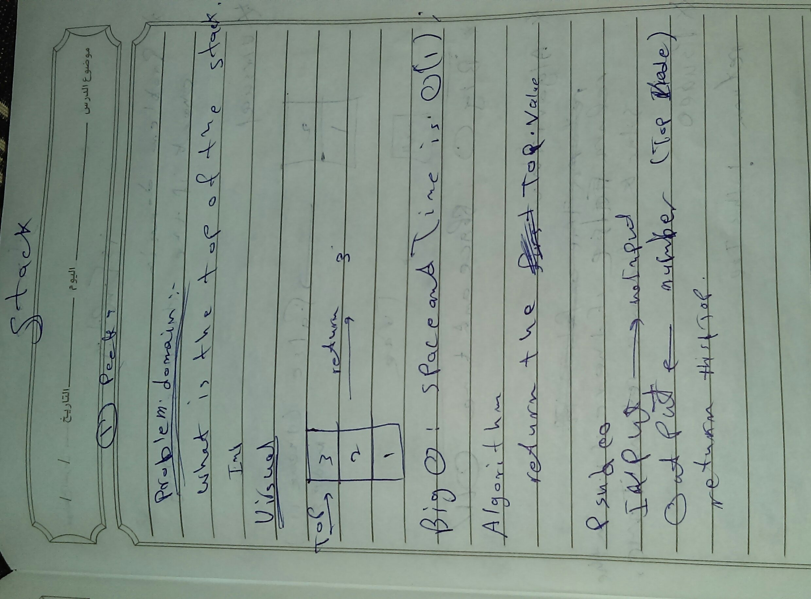
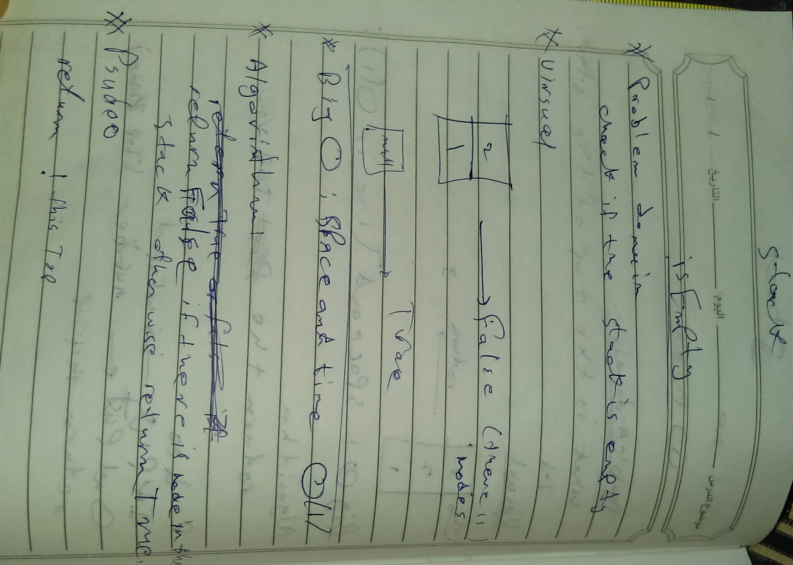
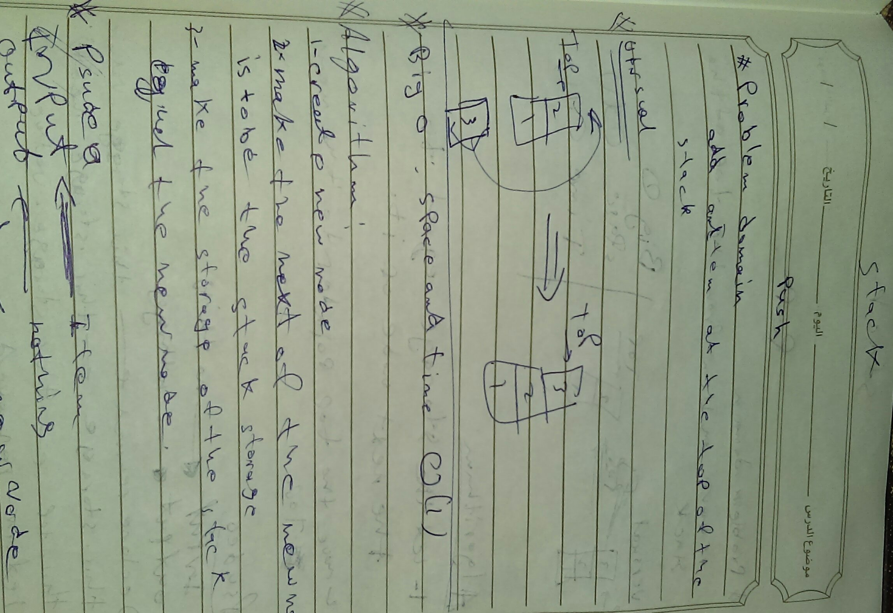
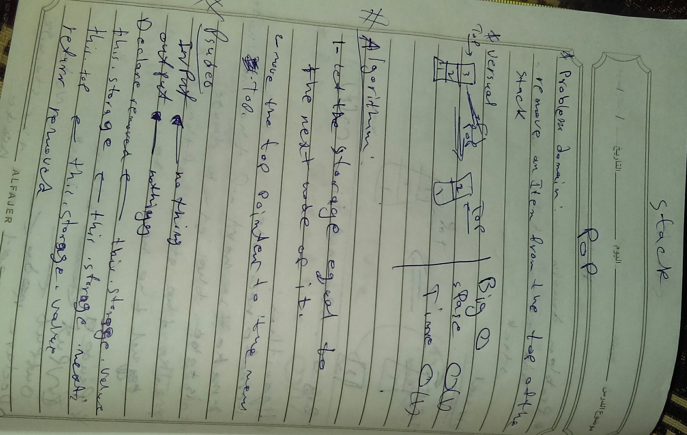
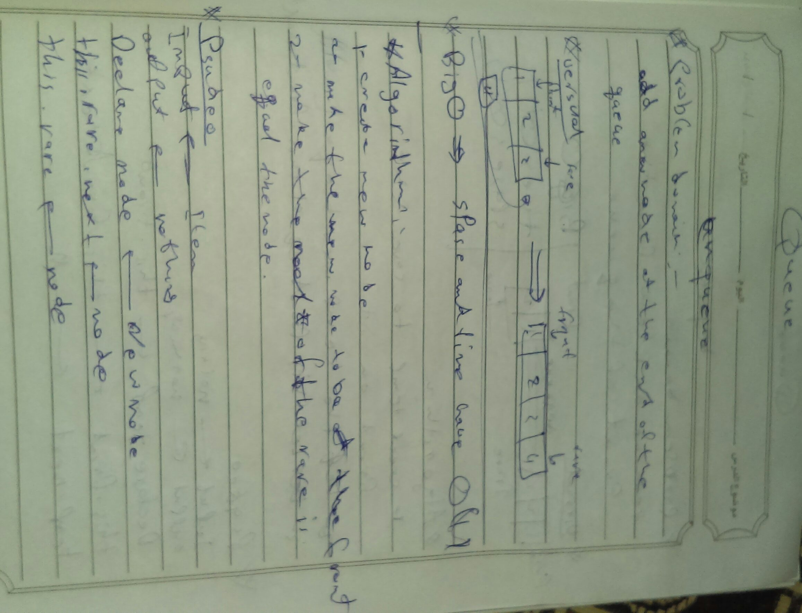
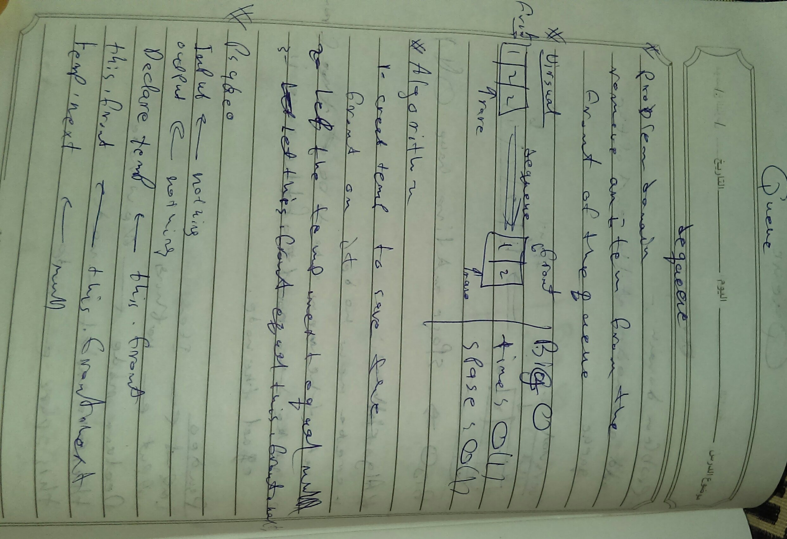

# Stacks and Queues
<!-- Short summary or background information -->
**Stack:(First In Last Out)**data structure that consists of Nodes. Each Node references the next Node in the stack, but does not reference its previous. 
**Queue:(First In First Out):** linear structure which follows a particular order in which the operations are performed.
## Challenge
<!-- Description of the challenge -->
creating a methods for Stack And Queue Data structure 
**Stack methods:** (peek, isEmpty, push, pop)
**Queue methods:** (peel, isEmpty, enqueue, dequeue)

## Approach & Efficiency
<!-- What approach did you take? Why? What is the Big O space/time for this approach? -->
Stack methods (peek, isEmpty, push, pop) tha BIG O is O(1) for all.and that because there is no loops 
Queue methods (peel, isEmpty, enqueue, dequeue)) tha BIG O is O(1) for all.and that because there is no loops 

## Solution

