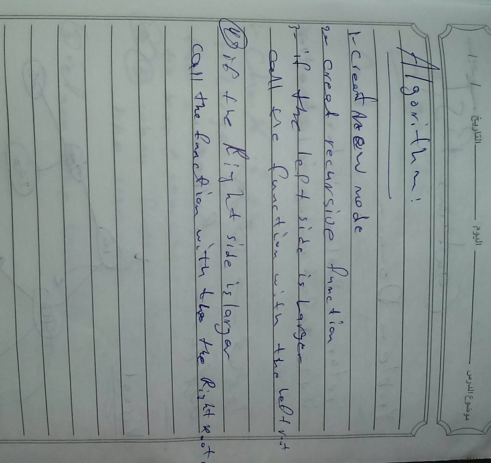
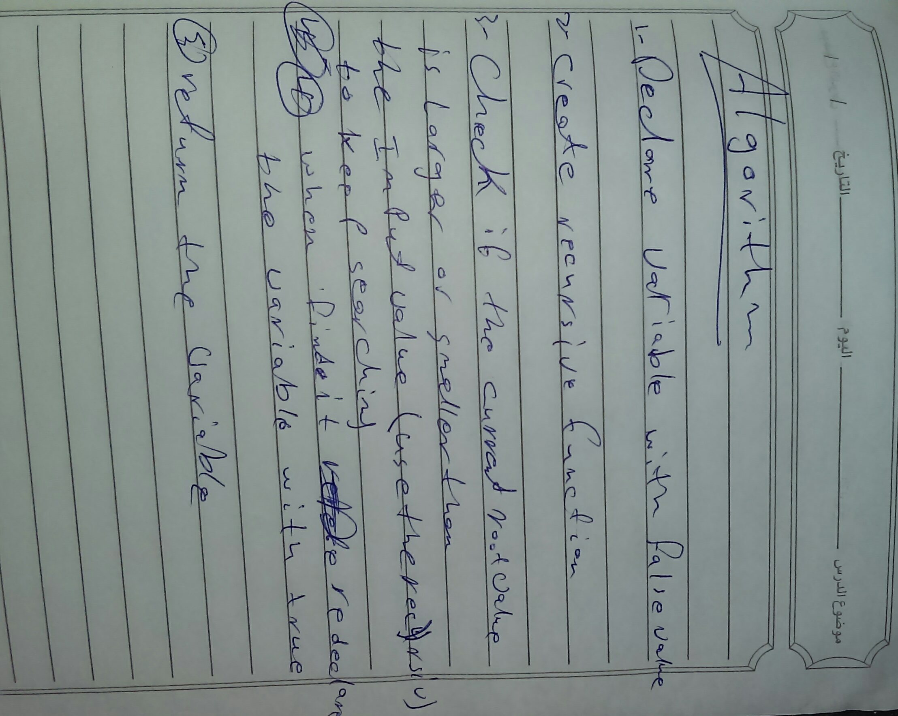
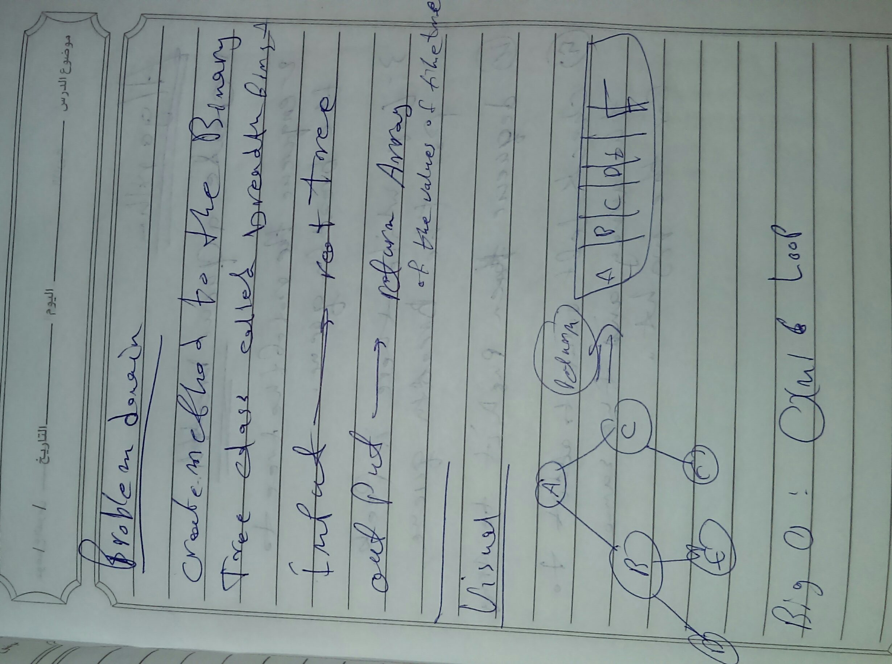

# TREE
<!-- Short summary or background information -->
## Challenge
<!-- Description of the challenge -->
- Create a Node class that has properties for the value stored in the node, the left child node, and the right child node.

- Create a BinaryTree class Define a method for each of the depth first traversals called preOrder, inOrder, and postOrder which returns an array of the values, ordered appropriately.

- Create a BinarySearchTree class Define a method named add that accepts a value, and adds a new node with that value in the correct location in the binary search tree. Define a method named contains that accepts a value, and returns a boolean indicating whether or not the value is in the tree at least once.

- create method to the binary tree class called breadthFirst to return an array with the tree nodes values .

- create method to find the  max value in the tree (findMaximumValue)

## Approach & Efficiency
<!-- What approach did you take? Why? What is the Big O space/time for this approach? -->
- the BIG O for the method (add, contains) is O(log n)in time and O(1)for the space
- the BIG O for the method (Breadth first) is O(n)in time and O(1)for the space
- the BIG O for the method (findMaximumValue) is O(n) and O(1) for the space

## Solution

