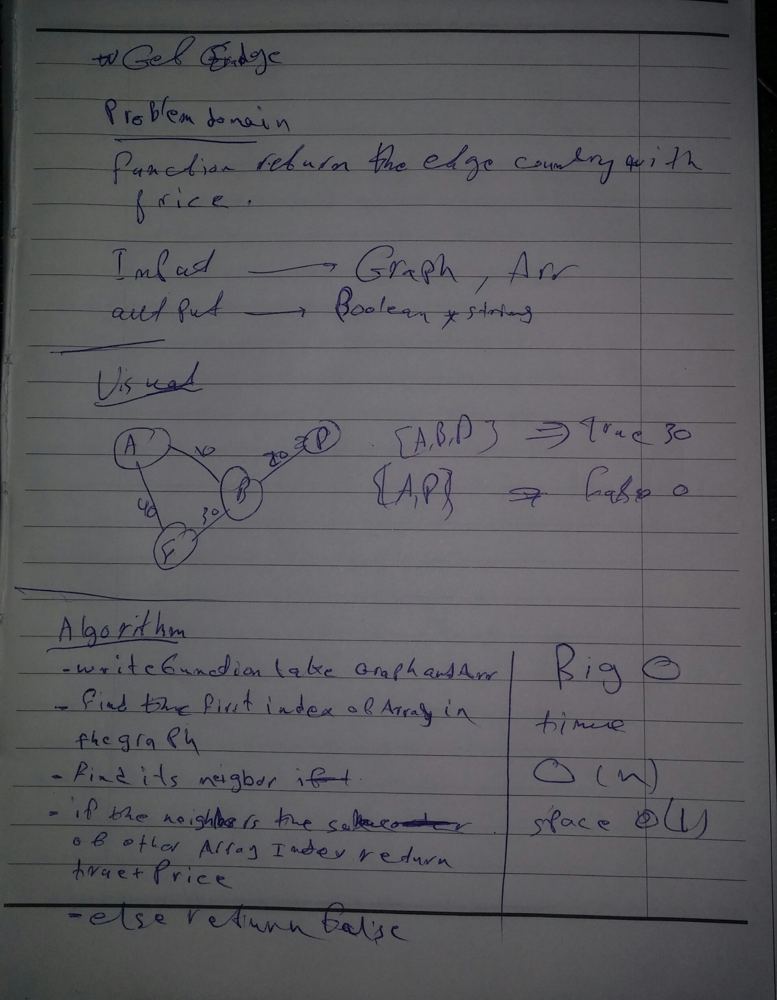

## get-edge.js

### Challenge
Extend graph object with a breadth-first traversal method that accepts a starting node

### Approach & Efficiency

I used the nested loop so the BIG O is O(n^2)

### Solution

<!--  -->