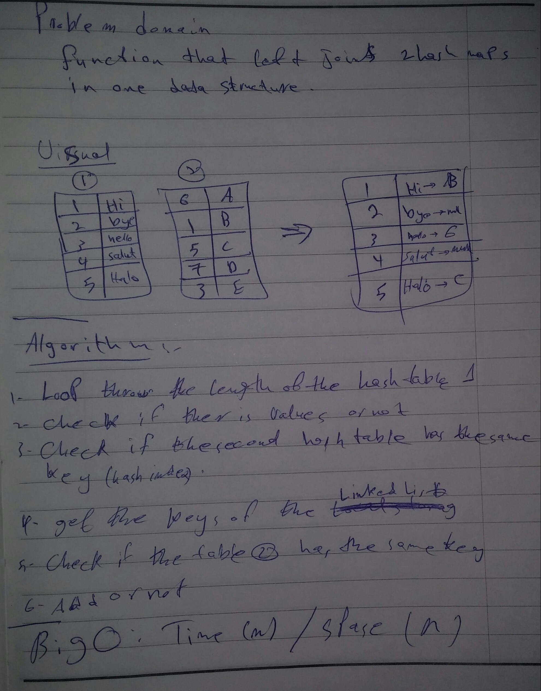

# Left-join
<!-- Short summary or background information -->
 returns all rows from the left table, even if there are no matches in the right table

## Approach & Efficiency
<!-- What approach did you take? Why? What is the Big O space/time for this approach? -->

BigO: time: O(n): the execution time changes linearly with the inputs number space: O(n): the space is increase linearly with the number of inputs through the whole operation

## Solution

<!--  -->
