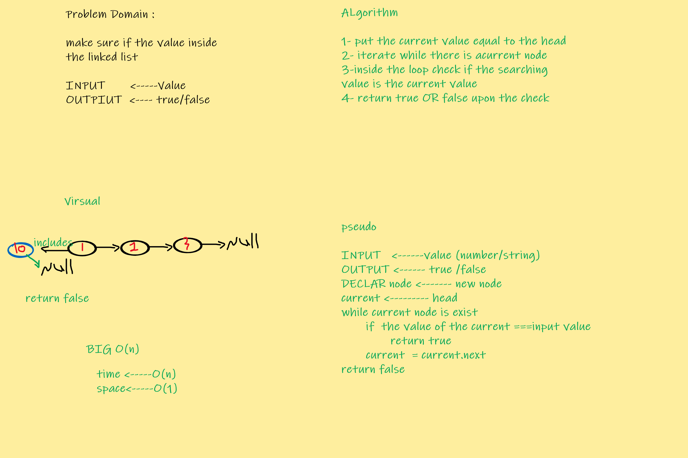
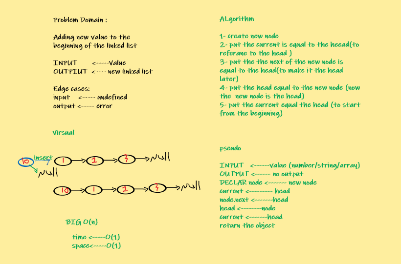

## [PR URL](https://github.com/yousef-401-advanced-javascript/data-structures-and-algorithms/pull/5)

## linked list
from the resource this is a data structure for linear collection of data elements
### Challenge
write methods for linked list data structure(insert,includes, toString)

### Approach & Efficiency

- for the insert method the BIG O(n) = O(1)for the time and the space 
- for the includes method the BIG O(n) = O(n)for the time and O(1) for the space
- for the toString method the BIG O(n) = O(n)for the time and the space 

### Solution

