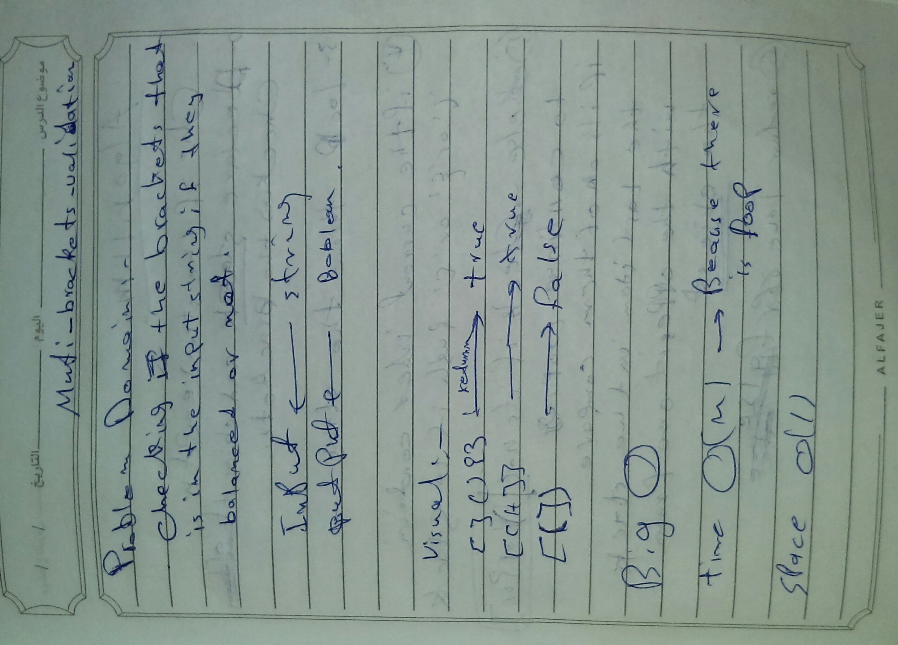
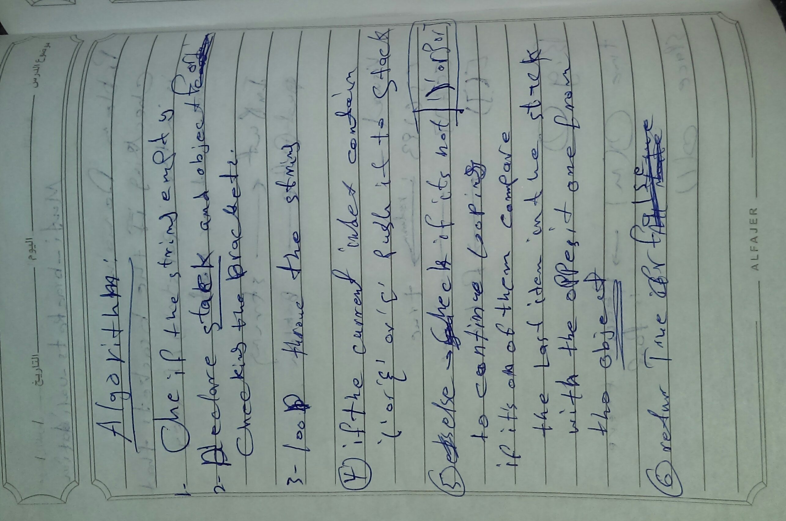

## Multi-bracket Validation

### Challenge
checking if the brackets that in the string are balanced or not

### Approach & Efficiency

i used the for loop and if statement /easiest way/ i think the BIG O for the tome is O(n) 
and O(1) for the space.

### Solution

