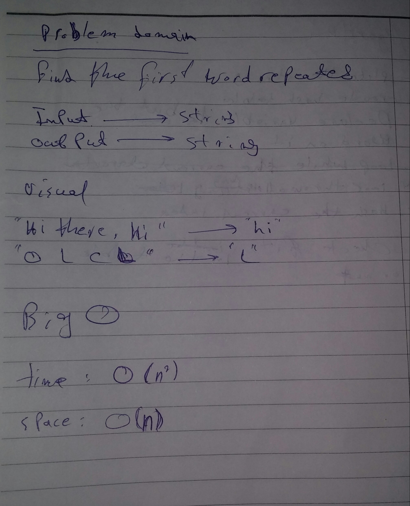
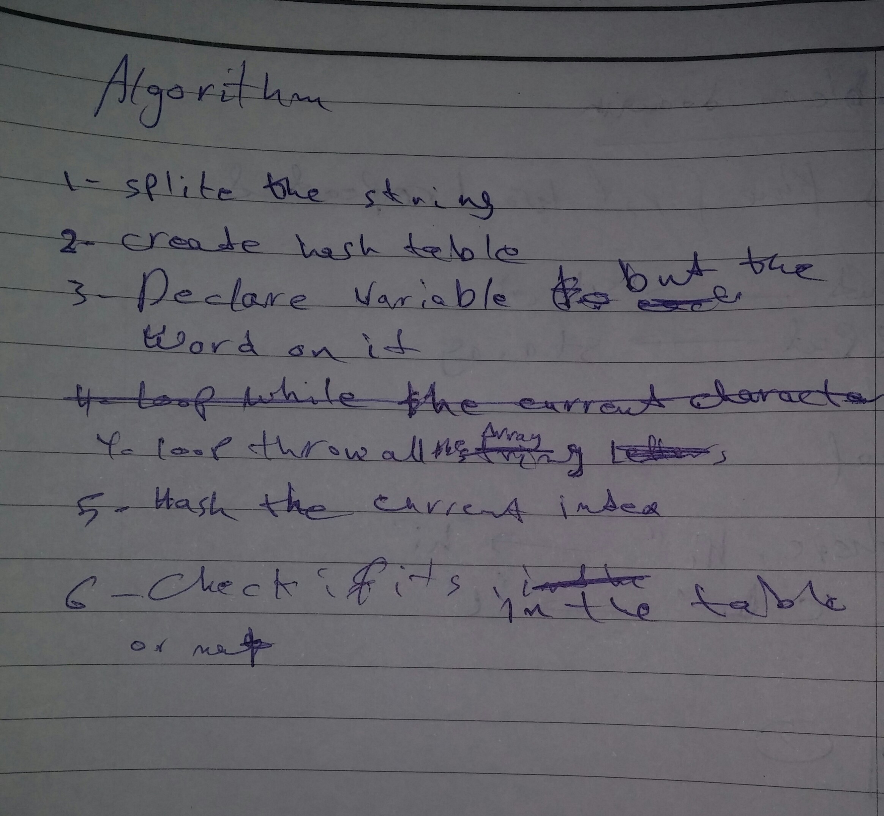

# Hash Table
<!-- Short summary or background information -->
 (hash map) is a data structure that implements an associative array abstract data type, a structure that can map keys to values. A hash table uses a hash function to compute an index, also called a hash code, into an array of buckets or slots, from which the desired value can be found

## Approach & Efficiency
<!-- What approach did you take? Why? What is the Big O space/time for this approach? -->

- (repeatedWord): tha BIG O is O(n^2) for all.and that because there is loops 

## Solution

