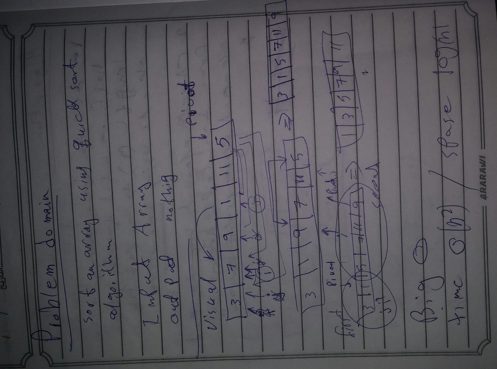

# Insertion sort
<!-- Short summary or background information -->
is a simple sorting algorithm that builds the final sorted array (or list) one item at a time.

## Challenge
<!-- Description of the challenge -->
- Sorting an array 

## Approach & Efficiency
<!-- What approach did you take? Why? What is the Big O space/time for this approach? -->
- the BIG O is O(n log n)in time and O(1)for the space 

## Solution

